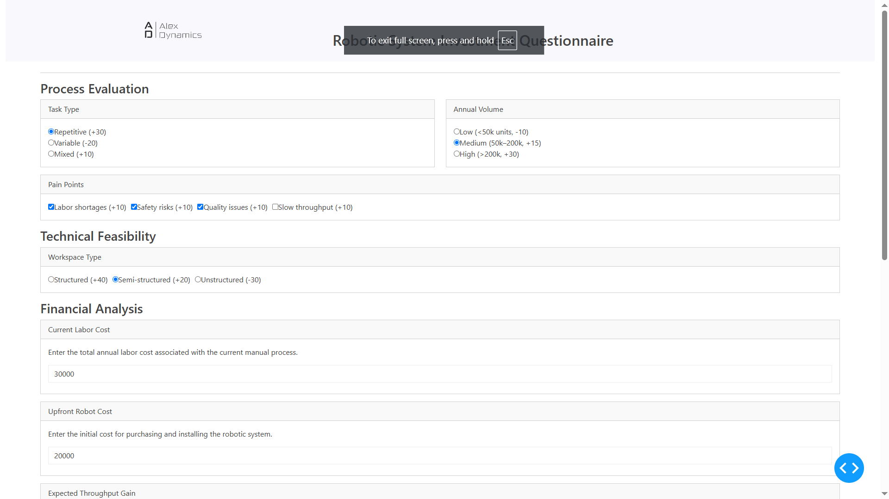
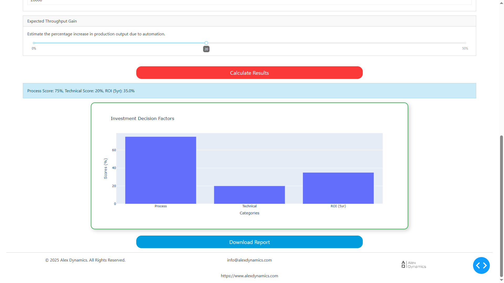

# Robotics System ROI Analyser Clients Plotly dash

## Description
This project is a Robotics System Analysis and Questionnaire designed to gather information and feedback from clients related to their need of a robot in their factory. It aims to facilitate data collection and analysis for robotics investment pointers to ease the decision making onto an investment.

## Installation
To get started with this project, clone the repository and install the required dependencies.

```bash
git clone https://github.com/yourusername/robotics-system-questionnaire.git
cd robotics-system-questionnaire
```

## Screenshots



## Usage
Run the questionnaire script using Python:
```bash
python questionnaire.py
```

## Contributing
Contributions are welcome! Please feel free to submit a pull request or open an issue for any suggestions or improvements.

## License
This project is licensed under the MIT License. See the [LICENSE](LICENSE) file for more details.

## Acknowledgments
- Emad el din for the development of this project.
- Any libraries or resources used in the project.
